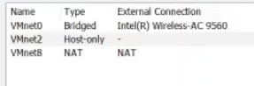
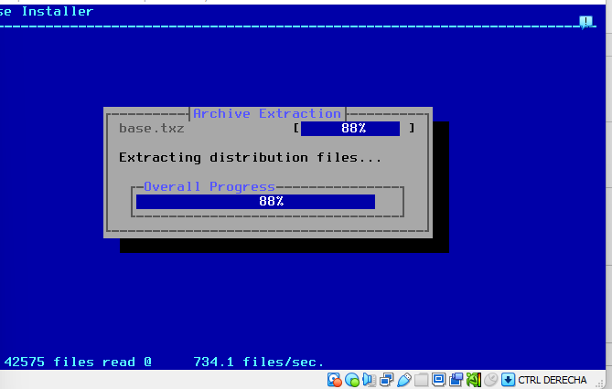
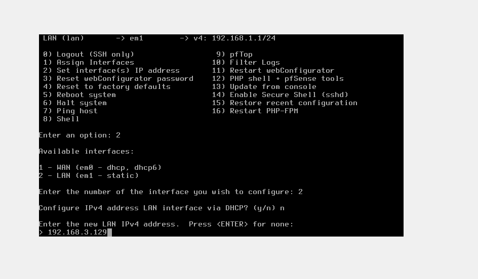
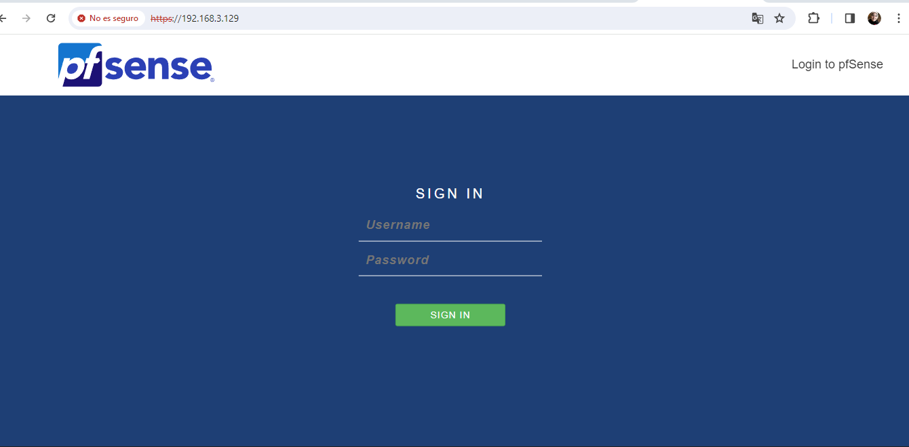
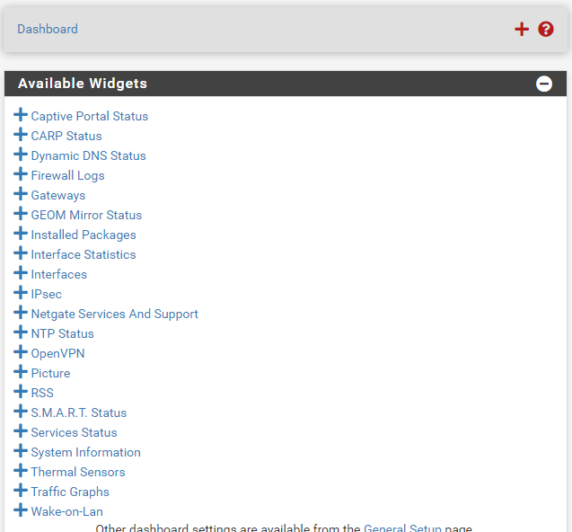
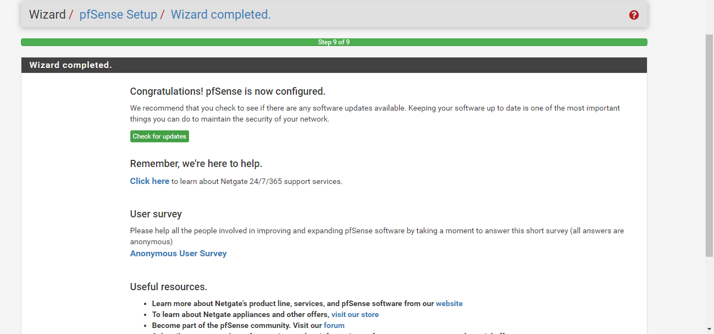
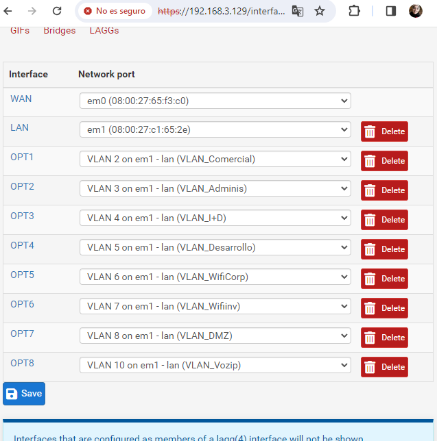
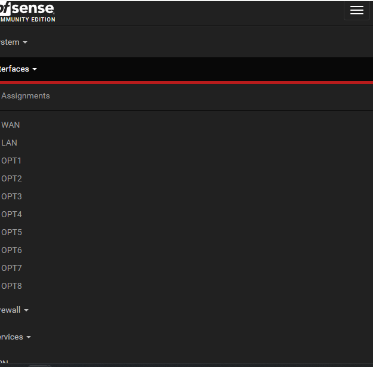

### Optimizing-Virtual-Networks-with-pfSense-Firewall-Configuration-on-VirtualBox
 
### 2.7.2-_RELEASE_
#### The pfSense project is a free network firewall distribution, based on the FreeBSD operating system with a custom kernel and including third party free software packages for additional functionality. 
https://www.pfsense.org/getting-started/
#### The combination of Host-Only, NAT, and Bridge network modes provides flexibility in configuring the virtual environment to meet various development, testing, or production needs.

## Objective: Optimize and maximize the security of a company's IT network.

#### the starting point is a Class C network, in which all departments will have IP addresses from that network without any kind of grouping, and the network devices such as switches have a flat configuration without VLANs, although they support such functionality. Internet connection is provided through a router configured in bridge mode(in this practice the host network), and a pfSense firewall that handles all necessary network services (DNS, DHCP, etc.).
#### For example, a company conducted a departmental classification and obtained the following list that we must use when creating our groupings using VLANs. Fragment the network type C into networks for each department:
#### Departments and Number of Hosts:

###### Sales → 5
###### Administrative → 6
###### R&D → 12
###### Development → 28
###### Wifi_Corp → 60
###### Wifi_Inv → 25
###### DMZ → 28
###### Management Network → 18
###### VoIP → 30

####  First, we need to Creat and configure an Ethernet network interface for pfSense in a virtualized environment. And configure it in host-only mode, with the VirtualBox network set to NAT and the host network set to bridge mode. The combination of Host-Only, NAT, and Bridge network modes offers flexibility in configuring the virtual environment to meet various development, testing, or production requirements.
#### PfSense is used in a wide variety of environments to provide advanced security and networking functionalities. Some common environments and use cases for pfSense include:

__Small and medium-sized enterprises__: pfSense is widely used in small and medium-sized enterprise environments to protect internal networks, implement security policies, and manage network traffic.

__Remote offices and branches__: In environments with multiple locations, pfSense is deployed to establish secure connections between remote offices .

__Internet Service Providers__ (ISPs): ISPs use pfSense to offer firewall and routing services to their customers.

__Home and SOHO networks__: pfSense is a popular choice for home users and small office/home office (SOHO) users looking for a powerful and customizable firewall and router solution to protect their home networks and manage Internet traffic.

__Virtualization environments__: In virtualization environments, pfSense is deployed as a virtual machine to provide firewall and routing services to other virtual machines on the same hypervisor.

__Testing and development labs__: IT professionals and technology enthusiasts use pfSense in lab environments to conduct tests, experiments, and development of network solutions.

#### For VirtualVox:

 
#### For VMware, it appears as follows: 

https://www.pfsense.org/

  

https://docs.netgate.com/pfsense/en/latest/?_gl=1*1wxiqco*_ga*OTE2OTQ4MzI5LjE3MDg2NDIwODM.*_ga_TM99KBGXCB*MTcwODg5NTYyOS41LjEuMTcwODg5NTgxNi40OS4wLjA.

 
#### PfSense Platforme 

#### Dashboard

#### Pfsense Configured

 
#### Interfaces

#### Interfaces-Assignments

  

