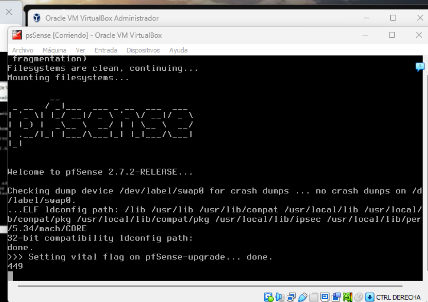

### Optimizing-Virtual-Networks-with-pfSense-Firewall-Configuration-on-VirtualBox
 
### 2.7.2-_RELEASE_
#### The pfSense project is a free network firewall distribution, based on the FreeBSD operating system with a custom kernel and including third party free software packages for additional functionality. 
https://www.pfsense.org/getting-started/

####  Create and configure an Ethernet3 network interface for pfSense in a virtualized environment, Additionally, it has been configured in host-only mode, with the VirtualBox network in NAT and the host network in bridge mode. 

#### For VirtualVox:

 
#### For VMware, it appears as follows: 

https://www.pfsense.org/

  

https://docs.netgate.com/pfsense/en/latest/?_gl=1*1wxiqco*_ga*OTE2OTQ4MzI5LjE3MDg2NDIwODM.*_ga_TM99KBGXCB*MTcwODg5NTYyOS41LjEuMTcwODg5NTgxNi40OS4wLjA.

 
#### PfSense Platforme 

#### Dashboard

#### Pfsense Configured

 
#### Interfaces

#### Interfaces-Assignments

  

