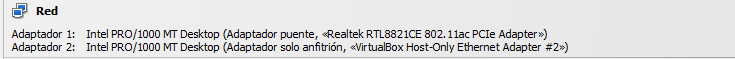

### Optimizing-Virtual-Networks-with-pfSense-Firewall-Configuration-on-VirtualBox
 
### 2.7.2-_RELEASE_
#### The pfSense project is a free network firewall distribution, based on the FreeBSD operating system with a custom kernel and including third party free software packages for additional functionality. 
https://www.pfsense.org/getting-started/

####  Creating and configuring an Ethernet3 network interface for pfSense in a virtualized environment. Additionally, it has been configured in host-only mode, with the VirtualBox network set to NAT and the host network set to bridge mode. The combination of Host-Only, NAT, and Bridge network modes offers flexibility in configuring the virtual environment to meet various development, testing, or production requirements.
#### PfSense is used in a wide variety of environments to provide advanced security and networking functionalities. Some common environments and use cases for pfSense include:

__Small and medium-sized enterprises__: pfSense is widely used in small and medium-sized enterprise environments to protect internal networks, implement security policies, and manage network traffic.

__Remote offices and branches__: In environments with multiple locations, pfSense is deployed to establish secure connections between remote offices .

__Internet Service Providers__ (ISPs): ISPs use pfSense to offer firewall and routing services to their customers.

__Home and SOHO networks__: pfSense is a popular choice for home users and small office/home office (SOHO) users looking for a powerful and customizable firewall and router solution to protect their home networks and manage Internet traffic.

__Virtualization environments__: In virtualization environments, pfSense is deployed as a virtual machine to provide firewall and routing services to other virtual machines on the same hypervisor.

__Testing and development labs__: IT professionals and technology enthusiasts use pfSense in lab environments to conduct tests, experiments, and development of network solutions.

#### For VirtualVox:

 
#### For VMware, it appears as follows: 

https://www.pfsense.org/

  

https://docs.netgate.com/pfsense/en/latest/?_gl=1*1wxiqco*_ga*OTE2OTQ4MzI5LjE3MDg2NDIwODM.*_ga_TM99KBGXCB*MTcwODg5NTYyOS41LjEuMTcwODg5NTgxNi40OS4wLjA.

 
#### PfSense Platforme 

#### Dashboard

#### Pfsense Configured

 
#### Interfaces

#### Interfaces-Assignments

  

